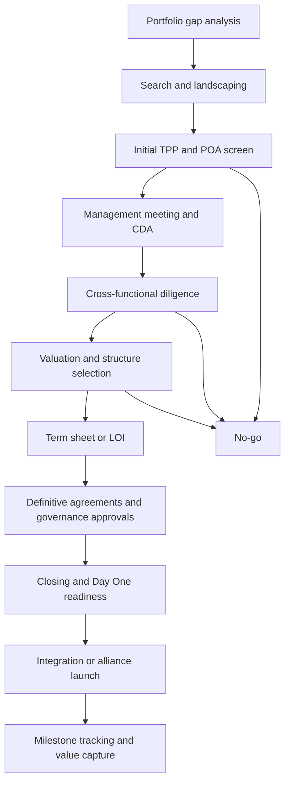

# Leaders in Biotech Business Development and M&A

## Executive summary

Biotech business development and M&A have become core engines of pipeline creation rather than side activities. McKinsey estimates that since 2018, more than 70% of new molecular entity revenue has come from externally sourced products, and roughly 45% of that revenue came from products sourced before launch. In 2025, life sciences M&A value reached about $372 billion, with biopharma dealmaking increasingly focused on growth assets, differentiated science, and portfolio repair ahead of looming loss-of-exclusivity cliffs. citeturn11view4turn11view5

Across the public record of leaders such as James Sabry, Boris Zaïtra, Adam Feire, Amanda Kay, and Monika Vnuk, the recurring mindset is consistent: stay patient-centered, be scientifically credible, search proactively rather than reactively, use flexible deal structures to manage uncertainty, and think in portfolio terms rather than as a one-asset buyer. Public comments from Roche, Biogen, Flagship, Sanofi, and Novartis all point in that direction. citeturn6search0turn7view1turn7view2turn8view0turn7view6turn7view7

For asset positioning, the most robust public framework is to combine a **target product profile** with a **probability-of-approval** view, then test the asset against strategic fit, differentiation, commercial feasibility, technical/CMC readiness, and dealability. FDA has described the TPP as a strategic development tool anchored in intended labeling concepts, while ICH Q8 states that the quality target product profile forms the basis for product design. Probability inputs remain critical because clinical attrition is still severe: across all indications in the BIO/QLS/Informa 2011–2020 dataset, Phase I→II success was 52.0%, Phase II→III 28.9%, Phase III→NDA/BLA 57.8%, and NDA/BLA→approval 90.6%. citeturn30search14turn30search8turn15view0

On transaction design, the market has shifted toward structures that push more value behind inflection points. In a 2,942-deal Biotechgate analysis of licensing transactions signed since 2010, 86.6% included upfront payments, 85.8% milestones, and 65.5% sales royalties; the authors concluded that deal economics remain strongly back-loaded. Recent public deals reinforce that pattern: Stoke/Biogen used upfronts, milestones, cost sharing, royalties, and follow-on options; GSK/Flagship used an umbrella exploration deal with program-by-program options; Sanofi used CVRs in public acquisitions of Inhibrx and Vigil; and GSK used an asset acquisition with success-based milestones for efimosfermin. citeturn14view1turn36view0turn36view3turn35view2turn35view3turn36view4

The best practical operating model is therefore not “buy everything” or “license everything.” It is to run a disciplined funnel: portfolio gap analysis, proactive search, early TPP/PTRS screen, staged diligence, multi-method valuation, structure selection, then either hybrid integration or alliance execution. Public guidance from McKinsey, EY-Parthenon, Deloitte, BDO, and company partnering pages supports exactly that workflow. citeturn32view0turn31view0turn34view0turn34view2turn12view0

## What leading dealmakers seem to optimize for

The leadership signal is less about charisma and more about operating philosophy. The consistent pattern is to combine scientific fluency with business judgment, to maintain therapeutic focus, and to use structure as a weapon against uncertainty rather than as a legal afterthought. Roche says it is “passionate about advancing science – no matter where it comes from” and signed 75 new agreements in 2025; Biogen explicitly describes BD as sitting at the intersection of business and science; Sanofi’s partnering leadership frames collaboration as essential because no company can keep up alone; and Flagship’s Amanda Kay argues for early, flexible, portfolio-style partnerships rather than one-off transactions. citeturn9search4turn39view3turn29view0turn7view6turn8view0

| Leader | Public role evidence | What the public record suggests they optimize for | Source link |
|---|---|---|---|
| **James Sabry** | Former Roche Global Head of Pharma Partnering; Roche former leadership profile confirms his senior Roche role. Public interview coverage emphasizes accelerating innovation through collaboration and meeting unmet need. citeturn7view0turn6search0 | Patient need first; external innovation as a core R&D input; willingness to partner on enabling technologies and emerging modalities. His public remarks around Roche’s Ascidian deal also stress transformative technology access. citeturn6news39turn6search0 | Roche bio and interview coverage |
| **Boris Zaïtra** | Roche Head of Corporate Business Development since 2024; prior M&A roles at JP Morgan, Duke Street, Airbus, then Roche group BD/M&A. citeturn7view1 | Institutionalized M&A discipline, board-level governance, and portfolio-scale capital deployment. Public coverage describes his remit as navigating a more expensive, more complex biotech market. citeturn7view1turn6search1 | Roche leadership page; trade interview |
| **Adam Feire** | Head of Business Development and External Innovation at Biogen; Biogen says he leads search and evaluation of external opportunities and transactions including M&A. citeturn7view2 | Search-and-evaluation rigor; diversified pipeline building; finding assets from discovery through commercial stage; alignment between science and strategy. citeturn7view2turn39view0 | Biogen press release and partnering page |
| **Amanda Kay** | Flagship Senior Partner and Chief Business Development Officer; leads platform- and asset-based partnerships and Innovation Supply Chain deals. citeturn7view3 | Early engagement, relationship building, optionality, and portfolio construction. She repeatedly highlights listening, candor, flexibility, and umbrella agreements that let science move faster. citeturn8view0 | Flagship bio and Q&A |
| **Monika Vnuk** | Sanofi SVP and Global Head of Partnering & Business Development. citeturn7view6 | Human-centric partnering, creative structures during biotech financing stress, and long-term collaboration as a core growth tool rather than a tactical fix. citeturn7view6turn27search2 | Sanofi interview and EI page |

A concise synthesis of their shared values looks like this. First, **patient impact is the explicit filter**: unmet need and medically meaningful differentiation are not branding language; they are the reason boards approve premiums. Second, **scientific fluency is non-negotiable**: Novartis’ BD&L material says search and evaluation requires a scientific background, typically PhDs and research experience, plus “a taste for business.” Third, **the best teams are proactive**: leading organizations are not merely reacting to inbound decks but actively forecasting where science, modalities, and portfolio gaps are converging. Fourth, **flexibility matters more than ideology**: public leaders increasingly prefer options, staged commitments, equity, milestones, and hybrid operating models when uncertainty is high. citeturn7view7turn8view0turn7view6turn39view1

Put bluntly, the public evidence does **not** support a simplistic “great BD people are aggressive negotiators” view. The highest-confidence pattern is different: great BD leaders are disciplined allocators of uncertainty. They know when to walk away, when to share risk, and when to pay up for truly differentiated science. McKinsey’s research on deal outperformers and portfolio leaders strongly supports that interpretation. citeturn31view0turn32view0

## How assets and targets are positioned, screened, and prioritized

I interpret **POA** here as **probability of approval**. In practice, the public frameworks suggest that asset positioning should start with a **TPP/QTPP**, then layer in **PTRS/POA**, strategic fit, and economic potential. FDA’s TPP guidance describes the TPP as a strategic development process tool tied to future labeling concepts, while ICH Q8 says the QTPP is the basis for product design. DNDi and WHO similarly describe TPPs as central to selecting and managing portfolios against defined decision matrices. citeturn30search14turn30search8turn30search15turn30search7

The most useful public-screening framework is below.

| Screening lens | Core question | Evidence or input you need | Why it matters |
|---|---|---|---|
| **Medical need and TPP** | If approved, what claim and use-case are you buying? | Indication, patient segment, line of therapy, endpoint strategy, dosing, route, safety, label ambition. FDA positions the TPP as the strategic anchor for development; ICH Q8 makes QTPP foundational for product design. citeturn30search14turn30search8 | Prevents buying an “interesting asset” that cannot support a differentiated label or viable market position. |
| **POA / PTRS** | What is the stage-adjusted likelihood of getting to approval? | Base rates plus asset-specific adjustments. BIO/QLS/Informa show Phase II is the main failure gate in aggregate clinical development. citeturn15view0 | This is usually the single largest swing factor in rNPV and milestone calibration. |
| **Strategic fit** | Does the asset fill a real portfolio gap or only add noise? | Current and future REVENUE-at-risk map, therapeutic-area depth, modality capabilities, commercial adjacency, LOE exposure. Leading biopharmas prioritize external sourcing to enhance blockbuster potential and manage risk/reward. citeturn32view0turn25view1 | Paying a premium for a non-core asset often creates integration drag and lower conviction. |
| **Differentiation** | Is this best-in-class, first-in-class, or just another participant in a crowded biology? | Comparative efficacy, safety, convenience, biomarker strategy, patient identification, CMC usability, platform edge. McKinsey warns about target crowding and stresses balancing novel MoAs with differentiated modalities. citeturn32view2 | Crowded assets can still work, but only if differentiation is concrete and commercializable. |
| **Technical and CMC readiness** | Can this actually be made, scaled, and controlled? | Analytical validation, stability, comparability, GMP readiness, scale/capacity, supply chain, COGS. citeturn12view0turn12view2 | Many deals fail in execution rather than in headline science. |
| **Commercial and access feasibility** | Is there a clear path to patient identification, launch, and reimbursement? | Epidemiology, competitive standard of care, market access assumptions, site-of-care, channel, geographies. Biogen explicitly screens rare diseases for clear patient identification and treatment pathways. citeturn39view0turn39view2 | A strong science story can still be a weak commercial asset. |
| **Dealability** | What structure matches the uncertainty profile? | Territory split, options, milestone schedule, equity, governance, CVR/earnout triggers, retained rights. citeturn36view0turn36view3turn35view0 | Structure is often the difference between “no” and “done.” |

Public company materials also show how target sourcing has become more deliberate. Novartis described a move from reacting to inbound opportunities to proactively searching globally for opportunities aligned to strategic priorities and even forecasting likely top opportunities six to nine months ahead. Sanofi’s China S&E head role explicitly requires landscaping, competitive intelligence, cross-functional evaluation, governance management, and portfolio reshaping in response to new external data. Biogen’s current partnering page similarly broadcasts precise therapeutic areas and modality/platform interests, which is effectively a public sourcing thesis. citeturn7view7turn29view1turn39view0

McKinsey’s evidence suggests the best-performing dealmakers also narrow focus instead of behaving like broad-index investors. Outperformers concentrated on fewer therapeutic areas, favored earlier-stage assets more than peers, and used data and analytics to identify the next wave of innovation. Their public recommendation is clear: sharpen therapeutic focus, use analytics to spot promising targets and modalities early, and keep pruning the portfolio against evidence thresholds. citeturn31view0turn32view0

A practical **target-prioritization template** you can reuse is this simple scorecard:

| Criterion | Weight | Scoring rubric |
|---|---:|---|
| Strategic fit to gap / LOE offset | 25% | 1 = adjacency only; 5 = directly fills a defined gap with strong internal capability leverage |
| Clinical differentiation vs SoC | 20% | 1 = parity/unproven; 5 = clinically meaningful advantage or new biology |
| POA / PTRS quality | 20% | 1 = base-rate only with weak translational evidence; 5 = strong human data and de-risked regulatory path |
| Commercial and access viability | 15% | 1 = unclear patient-finding/access path; 5 = attractive patient identification and payer logic |
| CMC / technical readiness | 10% | 1 = major scale/comparability risk; 5 = credible supply and quality path |
| Dealability / structure fit | 10% | 1 = value gap probably unbridgeable; 5 = obvious structure to align risk and reward |

Use it as a first-pass tool, not a substitute for diligence.

The typical deal process synthesized from public company operating descriptions, diligence guidance, and integration references looks like this. citeturn29view1turn12view0turn34view2turn34view0

## Deal types, structures, and negotiation playbooks

The best public evidence shows that the industry is using a broader menu of structures because uncertainty is being priced more selectively. PwC argues that strong balance sheets and more stable financing conditions are enabling acquirers to use minority, majority, and staged-option structures without sacrificing control or returns. McKinsey similarly notes that the share of value going to partnerships rose as premiums increased and companies sought to lower upfront exposure by shifting more economics into milestones and royalties. citeturn25view1turn31view0

### Deal-type comparison

| Deal type | Typical structure and terms | Advantages | Disadvantages | Public example |
|---|---|---|---|---|
| **Full acquisition** | Cash at close; sometimes stock; often public-deal CVR for one or two uncertain milestones; sometimes carve-out or spin-out of non-core assets. citeturn35view0turn35view2turn35view3 | Full control, no shared governance, full upside capture, cleaner portfolio repositioning. | Highest upfront capital, integration risk, antitrust/closing risk, more pressure if thesis is wrong. | Sanofi–Inhibrx: $30/share cash + $5 CVR + 0.25 share of spun-out New Inhibrx; Sanofi retained 8% of New Inhibrx. citeturn35view2 |
| **Asset acquisition / asset purchase** | Buy one program or asset rather than the whole company; upfront plus success-based milestones. citeturn36view4 | Avoids unwanted assets and overhead; simpler strategic fit. | Can be harder to separate people, know-how, contracts, and manufacturing dependencies. | GSK–Boston Pharma efimosfermin: $1.2B upfront + $800M milestones. citeturn36view4 |
| **Global or regional licensing** | Upfront + development/regulatory/commercial milestones + royalties; territory retained or split. Large database evidence shows most deals include this mix. citeturn14view1 | Lower upfront risk; scalable to geography/modality; preserves seller participation. | Governance complexity; incentives can diverge; full economics not captured by buyer. | Merck–Kelun: $175M upfront, up to $9.3B milestones, tiered royalties, with certain China rights retained by Kelun. citeturn36view5 |
| **Co-development / co-commercialization** | Upfront, milestones, cost-sharing, profit split in key territories, royalties elsewhere. citeturn35view4turn36view0 | Aligns incentives on development; leverages complementary capabilities; can preserve biotech independence. | Joint governance can slow decisions; future funding obligations remain. | Biogen–Sage: $875M upfront + $650M equity, up to $1.6B milestones, 50/50 U.S. development costs and profits, ex-U.S. royalties. citeturn35view4 |
| **Minority investment + collaboration** | Equity purchase, sometimes at premium, paired with option/ROFN or strategic rights. citeturn35view5turn37view0turn36view2 | Alignment without full takeout; information rights; can reserve access to future assets. | Limited control; valuation can still drift; insider signaling can complicate future sale. | Biogen–Ionis: $625M equity + $375M upfront, option rights and future milestones/royalties; Sanofi–Vigil: prior $40M strategic investment included exclusive right of first negotiation. citeturn35view5turn37view0 |
| **Option deal / option-to-license** | Fund an exploration phase or early development, then keep an exclusive option to license selected programs later. citeturn36view3turn36view0 | Caps early risk; preserves access to future science; good for platform-heavy uncertainty. | Can lose competitive momentum if option terms are weak; seller may feel constrained. | GSK–Flagship: up to $150M exploration funding, up to 10 programs each subject to GSK option, up to $720M per program plus royalties. citeturn36view3 |
| **JV / NewCo / equity partnership** | Parties combine assets, capabilities, or businesses into a jointly governed vehicle, often with equity splits or joint board. citeturn38view0turn38view1turn38view2 | Useful for platform building, regional plays, or ring-fencing non-core assets; can share risk and create financing optionality. | Governance heavier; exit rights and control terms become critical. | Harbour BioMed–Solstice: license plus upfront cash and Solstice equity; Harbour says it effectively co-founded a company around HBM4003. citeturn38view0 |

### What public data suggest about “typical” terms

The broadest accessible database evidence in this research set comes from the Biotechgate analysis of 2,942 licensing deals since 2010. It found that 86.6% of deals included upfronts, 85.8% milestones, and 65.5% sales royalties. Using average upfronts visible in the data, the authors modeled indicative total deal values of roughly **$450.3 million** for Phase I licensing, **$323.0 million** for Phase II licensing, and **$311.7 million** for Phase III licensing, and concluded that payment structures were clearly back-loaded. citeturn14view1

That does **not** mean every Phase I asset is “worth $450 million.” It means public headline “biobucks” should be treated cautiously. Royalties are often undisclosed or only broadly described, many milestones are far from guaranteed, and the negotiated split depends heavily on territory, modality, competitive tension, and how much value is being shared versus retained. The same paper explicitly notes the confidentiality problem around full licensing economics. citeturn14view1

### Negotiation and structuring tactics that consistently show up

A few tactics recur across public deals and legal analyses:

| Tactic | When it is most useful | Why it works | Public evidence |
|---|---|---|---|
| **Use CVRs/earnouts for one or two binary disputes** | Public acquisitions where the value gap is tied to approval, launch, or one key commercial milestone | Lets buyer cap fixed price while giving seller holders a clean path to upside | Public CVRs are usually standalone agreements, typically with only one or two milestones; Sanofi used regulatory and first-commercial-sale CVRs in Inhibrx and Vigil. citeturn35view0turn35view2turn35view3 |
| **Push economics behind objective inflection points** | Early or mid-stage licensing | Keeps upfront smaller and aligns payment with technical de-risking | McKinsey observed lower upfront percentages and more milestone/royalty linkage; the Biotechgate dataset shows back-loaded structures dominate. citeturn31view0turn14view1 |
| **Add equity when alignment matters** | Long-term platform relationships or when buyer wants strategic access without full control | Signals commitment and aligns upside | Biogen used large equity components in deals with Sage and Ionis; Harbour BioMed used equity in a NewCo-style asset partnership. citeturn35view4turn35view5turn38view0 |
| **Split territories if capabilities differ by region** | When biotech wants to retain core-market control or pharma wants ex-U.S./ex-China rights only | Creates a better capability match and can preserve seller value | Biogen/Stoke split North America from ex-North America; Merck/Kelun retained certain China rights for Kelun. citeturn36view0turn36view5 |
| **Use umbrella/portfolio agreements when platform optionality is high** | Platform companies, target-based collaborations, multi-program ecosystems | Reduces transaction friction and lets partner choose programs as evidence emerges | Flagship’s ISC model uses umbrella agreements with terms largely set upfront; GSK/Flagship reflects that logic. citeturn8view0turn36view3 |

A practical **term-sheet skeleton** for biotech BD/M&A should therefore force explicit answers to: asset scope, territory, rights retained, development responsibility, CMC responsibility, governance, economics at close, milestone definitions, royalty base and term, change-of-control treatment, diligence access, publication/data rights, IP ownership/improvements, step-in rights, termination triggers, and dispute resolution. When milestone language is vague, litigation risk rises; Cleary’s CVR review highlights how milestone drafting is often the crux of later disputes. citeturn35view1

## Valuation methods, inputs, and sample templates

The best public advice is to **triangulate**, not worship one model. WIPO’s biotech/pharma valuation guide describes the **market approach** as benchmarking against comparable deals but warns that comparables are often scarce or weak, especially for early-stage assets. Analysis Group’s 2024 practitioner guide highlights three commonly used methods for biotech assets: **rNPV**, a **VC-style valuation formula**, and **real options**. citeturn19search3turn14view0

### Valuation-method comparison

| Method | Best use case | Key inputs | Strengths | Weaknesses |
|---|---|---|---|---|
| **rNPV** | Clinical-stage assets and structured licensing decisions | Launch cash flows, price, penetration, market size, margin, timing, stage success probabilities, discount rate, remaining development costs | Most common biotech asset workhorse; transparent linkage between science, time, and economics | Sensitive to POA, pricing, peak share, and development timing assumptions | citeturn17view1turn18view0turn15view0 |
| **Market / comparable transactions** | Later-stage assets or when many relevant deals exist | Similar deals by modality, TA, phase, geography, retained rights, economics split | Grounds view in what buyers actually paid | Early-stage comparables are sparse and often not truly comparable | citeturn19search3turn14view1 |
| **Milestone / royalty model** | Licensing and collaboration negotiation | Upfront, dev/reg/commercial milestones, royalty rates, territory, launch profile | Mirrors how value is actually transferred in biotech | “Biobucks” can overstate realistic expected value; royalty disclosures are often limited | citeturn14view1turn36view0turn36view3turn36view5 |
| **VC method** | Company-level financing discussions for early-stage biotech | Exit EV multiple, timing to exit, VC hurdle rate, dilution | Useful when cash flows are too remote for credible DCF | Can diverge sharply from management’s rNPV view because hurdle rates are high | citeturn14view0turn18view3 |
| **Real options** | Very early-stage or platform-heavy programs with major stage-gate flexibility | Volatility, staged investment rights, abandonment/continue options, timing | Better captures value of flexibility under uncertainty | Harder to explain and less standardized in board discussions | citeturn14view4turn17view2 |

### The rNPV formula

A practical version is:

\[
\text{rNPV}=
\sum_t \frac{\text{Success Cash Flow}_t \times \text{Cumulative POA}_t}{(1+r)^t}
-
\sum_t \frac{\text{Development Cost}_t \times \text{Probability of reaching stage } t}{(1+r)^t}
\]

Analysis Group’s example shows the mechanics cleanly: the asset’s post-commercialization value is multiplied by the probability of commercialization, while each future stage cost is multiplied by the probability that the program actually reaches that stage. In their hypothetical case, expected PV of cash flows was **$123.7 million**, expected PV of development costs **$77.91 million**, and Phase I rNPV **$45.8 million**. citeturn18view0turn18view1turn18view2

### Illustrative rNPV calculation you can reuse

Using the BIO/QLS/Informa overall phase-transition rates as generic base rates, the cumulative Phase I-to-approval probability is roughly **7.9%**. Suppose your internal base-case model says that, **if approved**, the discounted value of future operating cash flows from today is **$1.2 billion**. Then expected discounted commercial value is about **$94.8 million** before development costs. If expected costs are $20 million now, $50 million in two years, $150 million in five years, and $3 million in eight years, then a simple stage-weighted expected cost PV is roughly **$55–56 million** at a 10% discount rate, implying an rNPV of about **$39 million**. The exact result will change materially with asset-specific POA, time-to-market, price/access, and CMC risk; this is only a reusable template. The key lesson is that small changes in phase success and launch timing dominate the result. citeturn15view0turn18view0turn18view2

### Milestone and royalty template

Use the following as a **working negotiation template**, not as market law:

| Term bucket | Example structure logic |
|---|---|
| Upfront | Usually highest when competitive tension is strong, the buyer wants exclusivity, or the asset already has compelling human data |
| Development milestones | Tie to IND/CTA, first-patient-in, Phase II PoC, Phase III start/completion |
| Regulatory milestones | NDA/BLA/MAA acceptance, approval in major markets, label breadth |
| Commercial milestones | First commercial sale; sales thresholds; certain market launches |
| Royalties or profit share | Tiered rate tied to net sales, margin, or region; higher if licensor contributes less late-stage cost and gives broader rights |
| Equity | Add when alignment, board access, or strategic signaling matters |
| CVR / earnout | Best when disagreement is concentrated in one measurable binary event |

A good practical rule is that if valuation disagreement is mostly about **one future event**, use a CVR/earnout. If the disagreement is about **the whole path of the asset**, use a staged licensing structure. If the disagreement is about **future platform value**, use options and/or equity. That is the pattern public deals keep showing. citeturn35view0turn36view0turn36view3turn35view5turn38view0

### Comparable-transactions sanity checks

When you run comparables, match on more than phase. At minimum, filter for therapeutic area, modality, biomarker/use-case, territory, exclusivity, rights retained, control level, and whether the deal includes platform value. WIPO explicitly notes that the market approach is constrained when comparables are not genuinely comparable, especially in early-stage biotech. citeturn19search3turn19search6

Useful public charts for benchmarking include the BIO phase-transition chart and the Biopharma Dealmakers licensing-payment chart. citeturn15view0turn14view1

## Diligence, integration, and acquirer readiness

### Diligence checklist you can use

BDO’s biotech diligence checklist is unusually practical and broad. It covers technical capabilities, facilities, process/product development, operations, quality systems, management, staffing, regulatory, and business/financial issues. BioPharm International adds a crucial operational point: scientific diligence should not stay with a tiny core team but should deliberately pull in clinical, non-clinical, regulatory, manufacturing, IP, legal, and commercial stakeholders as the process deepens. citeturn12view0turn12view2turn11view1

| Diligence workstream | What to review | Common red flags |
|---|---|---|
| **Scientific / technical** | Platform reproducibility, mechanism, assay validity, analytical method qualification/validation, stability, comparability, biophysical characterization, GMP readiness, manufacturing scale/capacity. citeturn12view0turn12view2 | Mechanism story stronger than data; poor assay robustness; scale-up or comparability unresolved |
| **Clinical** | Endpoint rationale, target population, inclusion/exclusion logic, safety events, dose selection, external control landscape, protocol feasibility, missing data handling, site readiness. Cross-functional clinical review is specifically recommended. citeturn11view1 | Weak PoC, noisy subgroup effects, endpoint not likely to support label ambition |
| **Regulatory** | History of agency interactions and inspections, IND/BLA readiness, designation strategy, CMC package gaps, comparability expectations. citeturn12view0turn12view3 | No clear regulatory path; major agency feedback risk; underdeveloped quality package |
| **Commercial** | TPP-to-market fit, competitive set, patient finding, GTM feasibility, pricing/access assumptions, geography, channel, launch sequencing. BDO includes TPP, marketing, business plan and COGS; Sanofi and Biogen job materials show these functions are built into S&E. citeturn12view1turn29view1turn29view0 | Attractive science but no viable market-access or patient-identification path |
| **Financial** | Funding, cash runway, COGS, forecast logic, audit quality, debt/covenants, off-balance-sheet obligations. citeturn12view1turn34view2 | Runway too short post-sign; forecasts ignore launch friction; covenant issues |
| **Legal / IP** | Ownership chain, in-licenses, field/territory restrictions, FTO, prosecution history, litigation, publications, data/privacy obligations, change-of-control clauses. BDO includes IP explicitly; public deal structures show retained rights and carve-outs often drive value. citeturn12view1turn35view2turn36view5 | Encumbered IP; retained rights undermine strategic thesis; unclear know-how transfer |
| **People / integration** | Scientific leadership, track record, org design, turnover, key person dependency, training, alliance-management capacity. citeturn12view0turn12view3 | Asset depends on a few individuals with weak retention plan |

A simple diligence rule: if the core debate is happening in PowerPoint rather than in source data, stop and reopen the data room.

### Integration playbook for biotech acquirers

For pre-commercial biotech, the public evidence is clear that “standard PMI” often fails. EY-Parthenon says most pre-commercial acquisitions miss expectations and argues against both extremes: fully absorbing the target can stifle it, while leaving it entirely standalone can create capability gaps and operational issues. Their recommended pattern is a **hybrid operating model**: integrate quality and back-office functions relatively quickly, preserve domain-specific R&D capabilities where continuity matters, and design the transition model before close. citeturn34view0

Deloitte’s Day One readiness work reinforces the operational side: use clear readiness checkpoints to ensure business continuity in contracts, go-to-market, supply chain, payroll, IT cutover, and finance/treasury. McKinsey’s broader PMI work adds the value-capture rule: leaders keep explicit governance on synergy capture well past Day 100 and track leakage, not just headline targets. citeturn34view2turn34view1

A practical **biotech integration playbook** is:

| Time window | Must-win actions |
|---|---|
| **Pre-sign to sign** | Build operating-model hypothesis; identify what must stay intact for trials, CMC, safety, and key talent continuity; map Day One legal and data-room dependencies. citeturn34view0turn34view2 |
| **Sign to close** | Confirm sponsor-transfer plan, safety reporting continuity, quality-system alignment, retention packages, and governance design for R&D vs G&A. citeturn34view0turn34view2 |
| **Day One to Day 30** | Keep trials, supply, payroll, sourcing, and finance running; communicate decision rights; implement legal-entity and banking/cash-management readiness. citeturn34view2 |
| **Day 30 to Day 100** | Pressure-test development plan, refresh valuation with actual access to target data, finalize end-state operating model, begin value-capture tracking. citeturn34view0turn34view1 |
| **Post-Day 100** | Track milestone readiness, synergy leakage, talent retention, and whether the original deal thesis is still true. citeturn34view1 |

### Cash management and capital allocation for acquirers preparing to buy

The current public market context matters. PwC says sector balance sheets and cash positions remain strong, and financing conditions now support use of minority, majority, and staged structures. McKinsey similarly points to strong balance sheets and growing urgency to augment pipelines. That means the question is less “can we buy?” and more “what is the cheapest **risk-adjusted** form of control?” citeturn25view1turn24search1

A practical **buyer-readiness checklist** should include:

| Capital-allocation question | Why it matters | Public evidence |
|---|---|---|
| Have we quantified LOE exposure and portfolio gaps by TA and modality? | It determines whether you need revenue replacement, capability acquisition, or both. | McKinsey and PwC both frame current M&A as a response to LOE and white-space pressure. citeturn11view5turn25view1 |
| Are we using the least expensive control structure for this uncertainty level? | Full acquisitions are not always the efficient answer; staged options and minority stakes can preserve upside with less fixed spend. | PwC highlights minority and staged options; public deals show this in practice. citeturn25view1turn36view3turn37view0 |
| Have we preserved liquidity and covenant headroom post-close? | Day One failures are often operational and treasury-related, not strategic. | Deloitte explicitly includes banking strategy and cash management in Day One readiness. citeturn34view2 |
| Can structured or non-dilutive financing improve flexibility? | Debt, synthetic royalty, drug-development financing, and royalty monetization can preserve equity capital. | Covington identifies five key non-dilutive financing routes used in life sciences and explains their structures. citeturn25view0 |
| Is our bid calibrated to actual differentiation, not generic scarcity? | Scarcity can justify premiums only for assets with real patient benefit and plausible regulatory/commercial paths. | PwC notes premiums for innovation where there is meaningful patient benefit and a credible launch path. citeturn25view1 |

The practical implication is simple: build a **structure ladder** before you bid. For each target, decide in advance whether your first choice is option, minority stake, regional license, co-dev, asset purchase, or full buyout. If you skip that discipline, negotiation becomes emotional and capital allocation gets sloppy.

## Career paths, skills, and practical entry steps

The career evidence from public bios and job descriptions is fairly consistent. Senior BD leaders often come from one of four lanes: **scientist/search-and-evaluation**, **clinician/development**, **finance/M&A or strategy**, or **venture/corporate development**. Boris Zaïtra came from classic M&A and private equity before Roche. Adam Feire came from scientific training and search/evaluation inside pharma. Amanda Kay blends biology, finance, operations, and strategy. Sanofi’s China S&E role explicitly prefers PhD/MD training, deep scientific experience, and prior evaluation of clinical-stage assets. citeturn7view1turn7view2turn7view3turn29view1

Biogen’s career page is unusually direct: its BD and External Innovation team evaluates growth opportunities and leads transactions with partners, “positioned at the intersection of business and science.” Biogen’s finance function also describes work on pricing strategies, project feasibility, and financial diligence on collaboration efforts. Pfizer’s R&D Rotational Program and MBA Summer Associate Program show two classic entry ramps: science/clinical operations for STEM graduates and strategy/finance/marketing for MBA candidates. citeturn29view0turn29view2turn29view3

### A practical pathway map

| Starting point | Best near-term move | What to build |
|---|---|---|
| **PhD / bench scientist** | Move into translational strategy, portfolio strategy, alliance management, or search & evaluation | TPP building, competitive landscaping, basic valuation, partnering presentations |
| **Clinician / clinical development** | Add cross-functional exposure to regulatory, medical, and commercial strategy | Label strategy, endpoint economics, patient-finding and market-access logic |
| **Banking / corp dev / strategy** | Learn science deeply enough to challenge asset narratives and interpret clinical evidence | Mechanism literacy, CMC basics, regulatory path, TA-specific pattern recognition |
| **Commercial / market access** | Move toward portfolio strategy or cross-functional due diligence | Market sizing, willingness-to-pay logic, launch-readiness, payer dynamics |
| **Early-career entrant** | Use R&D rotational, MBA associate, fellowship, or venture internship routes | Technical credibility plus communication and financial modeling |

### The skills that actually matter

The public materials do **not** support the idea that biotech BD/M&A is mostly legal drafting or banker-style auction work. The recurring required skills are: scientific judgment, asset framing, structured communication, cross-functional leadership, portfolio thinking, valuation fluency, and enough legal/commercial understanding to avoid obvious errors. Sanofi’s S&E role explicitly includes landscaping, competitive intelligence, due-diligence leadership, governance-board preparation, and optimal scientific deal structures. Biogen’s own public materials emphasize tailored deal structures and hands-on support. citeturn29view1turn39view0

### A concrete ninety-day entry plan

| Timeframe | Action |
|---|---|
| **First month** | Pick one therapeutic area and read it deeply: disease biology, current SoC, major upcoming catalysts, key private and public players. Build one target landscape slide. |
| **Second month** | Model one recent public deal three ways: rNPV, comparable transactions, and milestone/royalty waterfall. Write a one-page investment memo and a one-page red-team memo. |
| **Third month** | Practice cross-functional communication: present the same asset to a scientist, a finance person, and a commercial leader in three different ways. Then ask what each thinks you missed. |

If you want a fast screen for whether you are progressing, ask yourself three questions: **Can I explain why this asset matters? Can I explain what would kill it? Can I explain what structure best matches the uncertainty?** If not, you are not yet thinking like a BD/M&A operator.

## Open questions and limitations

Some important parts of biotech dealmaking remain opaque in public sources. Royalty tiers, governance rights, diligence findings, and many milestone definitions are often partially or wholly undisclosed; the Biopharma Dealmakers licensing analysis explicitly notes confidentiality as a major limit. Public interviews also reveal philosophy more readily than internal scoring models, so the mindset synthesis above is stronger than any claim about exact internal investment committees. Finally, among the named leaders, public official detail was strongest for Roche, Biogen, Flagship, and Sanofi; James Sabry’s current post-Roche remit was less clearly documented in official sources consulted here, so this report focuses on the philosophy visible during his Roche leadership tenure. citeturn14view1turn7view0

